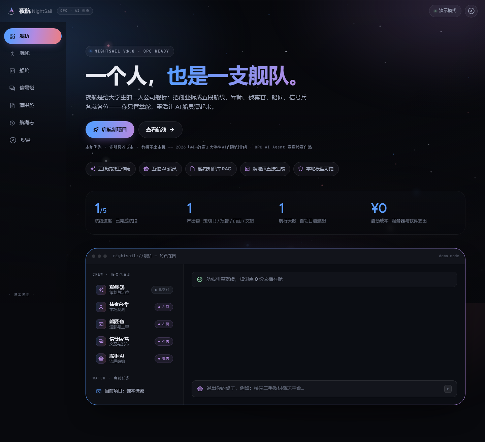

# 夜航 NightSail · 大学生一人公司 AI 舰桥

> 2026「AI+教育」创新应用技能大赛 · 大学生AI创新创业组 · **大学生OPC创新创业AI Agent 赛道** 参赛作品
> 把创业拆成五段航线：立意 → 侦察 → 造船 → 亮灯 → 顺风。你是船长，AI 船员负责其余一切重活。



---

## 一、30 秒跑起来

**方式 A（推荐）**：双击 `启动夜航.bat`（需 Python 3.x，自动开浏览器）。

**方式 B**：直接双击 `index.html`。演示模式下功能完整可用（纯静态、无构建、无模块加载）。

**方式 C**：命令行 `python -m http.server 8123` 后访问 http://127.0.0.1:8123。

首次进入会自动弹出**起航仪式**：给项目命名 + 一句话定位（可点示例点子）→ 点「启航」→ 军师开始起草第一份交付物。

## 二、接上真模型（可选）

默认**演示模式**离线可跑通全流程（脚本内容，界面上有明确标识）。要接真实大模型，进入 **罗盘** 舱：

| 预设 | BASE URL | 说明 |
|---|---|---|
| 本地 llama.cpp | `http://127.0.0.1:8080/v1` | 模型名填你加载的模型（如 `minicpm5`），无密钥、断网可用、数据不出机 |
| 智谱 GLM | `https://open.bigmodel.cn/api/paas/v4` | 填开放平台 API Key |
| DeepSeek | `https://api.deepseek.com` | 填 API Key |
| Moonshot Kimi | `https://api.moonshot.cn/v1` | 填 API Key |
| 自定义 | 任意 OpenAI 兼容接口 | Ollama 填 `http://127.0.0.1:11434/v1` |

密钥仅存本机 localStorage，请求由浏览器直发你所填的接口。若云端接口有跨域（CORS）限制，优先用本地模型。

## 三、七个舱室

| 舱室 | 干什么 |
|---|---|
| **舰桥** | 项目总览、船员花名册与实时状态、快速指令输入 |
| **航线** | 五段航程工作流：每段由对应船员起草一份可直接使用的交付物（策划书/侦察报告/造船清单/发布包/增长计划），支持重新起草与导出 .md |
| **船坞** | 生成**单文件落地页**（HTML），内嵌实时预览、下载、新窗口打开 |
| **信号塔** | 按渠道语气生成推广文案（小红书/朋友圈/校园公告/知乎），一键复制 |
| **藏书舱** | 本地知识库：粘贴任意文本自动分段；生成时检索最相关段落注入上下文（本地 RAG，bigram 打分，检索试验台可解释） |
| **航海志** | append-only 项目日志，一键导出 .md —— OPC 迭代速度的证据链 |
| **罗盘** | 引擎接口配置、连接测试、数据清空 |

## 四、架构（纯静态 · 零依赖 · 零成本）

```
nightsail/
├─ index.html          # 单页应用外壳（7 视图 + 起航仪式弹窗）
├─ css/night.css       # 设计系统（转译自 antigravity-drift 深色套件）
├─ js/
│  ├─ md.js            # 轻量 Markdown 渲染器（自研 ~100 行）
│  ├─ store.js         # 状态层：localStorage + 分段 + bigram 检索
│  ├─ llm.js           # OpenAI 兼容 SSE 流式客户端
│  ├─ demo.js          # 演示模式脚本内容（离线可跑通全流程）
│  ├─ dust.js          # 上浮尘埃粒子场（canvas）
│  └─ app.js           # 路由 / 五段航线工作流 / 各舱室逻辑
├─ fonts/              # Figtree · JetBrains Mono · Material Symbols 子集（离线）
├─ 参赛材料/            # 作品介绍文档 · 演示视频脚本
└─ _check.py           # Playwright 自检脚本（截图 + 控制台错误捕获）
```

- **无框架、无构建、无服务器**：任何人双击即可运行，托管到任意静态平台即"上线"。
- **提示词工程**：五个航段各有一套结构化提示词（见 `js/app.js` 的 `STAGE_PROMPT`），要求表格化、可执行、杜绝空话。
- **OPC 叙事**：本作品由一名学生与 AI 结对完成——它的开发过程本身就是赛道题眼的答案。

## 五、自检

```bash
python -m http.server 8123
python _check.py        # 走通：起航 → 生成 → 落地页 → 文案 → 知识库 → 导出
```

截图输出在 `_shots/`。最近一次全流程自检：9 张截图全部通过，控制台 0 报错。

## 六、提交前备忘（以大赛官网参赛指南为准）

- [ ] 大学生AI创新创业组作品提交截止：**2026-10-15**（报名平台自动生成申报书）
- [ ] 作品介绍文档转 PDF 上传（`参赛材料/作品介绍文档.md` 已按要求字段写好）
- [ ] 录制 ≤10 分钟演示视频（分镜见 `参赛材料/演示视频脚本.md`）
- [ ] 应用成效一节：用真实试点数据替换文档中的占位标注
- [ ] 原创承诺：确认后签名
